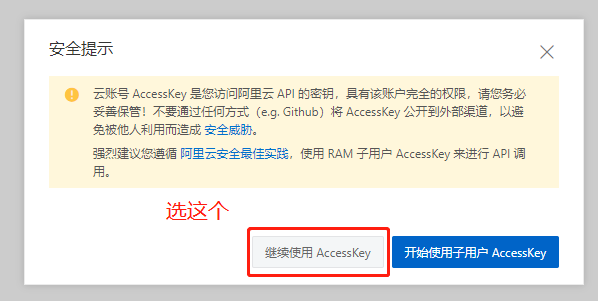
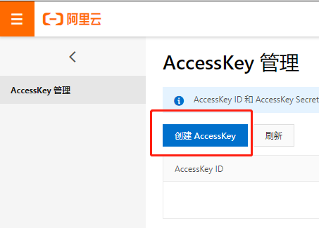

# 申请阿里翻译

::: tip
文档内容可能会过时，请以阿里云平台官网说明为准。

相关链接：[阿里云通用版翻译引擎介绍](https://www.aliyun.com/product/ai/base_alimt) [阿里云机器翻译通用版定价文档](https://help.aliyun.com/document_detail/158294.html)
:::

## 价格

阿里翻译**每月的前 100 万字符免费，超出的部分会按照 50 元 / 百万字符收取费用，费用由阿里翻译在它自己的[阿里云官方网站](https://www.aliyun.com/)收取，与划词翻译无关。**

## 申请步骤

### 第一步：开通通用版翻译引擎

打开[阿里云机器翻译管理控制台](https://mt.console.aliyun.com/basic)，登录成功后，会看到如下界面，然后点击【通用版翻译引擎】下方的【立即开通】按钮。

点击之后会让你勾选一个【机器翻译服务协议】，勾选之后点【立即开通】就能开通成功了。

### 第二步：创建 AccessKey

开通之后，回到[阿里云机器翻译管理控制台](https://mt.console.aliyun.com/basic)，把鼠标移动到页面右上角的头像上悬停，然后点击【AccessKey 管理】，会跳转到 [AccessKey 管理页面](https://ram.console.aliyun.com/manage/ak)。

进入后会弹出一个安全提示，为了避免麻烦，选择【继续使用 AccessKey】即可。

然后点击【创建 AccessKey】按钮：

点击之后会让你输入手机短信验证码，输入之后会提示 AccessKey 创建成功，如下图：

### 第三步：在划词翻译中填写 AccessKey

将上图中的【AccessKey ID】和【AccessKey Secret】填写进划词翻译的【设置页】-【服务申请】-【阿里翻译】中即可。