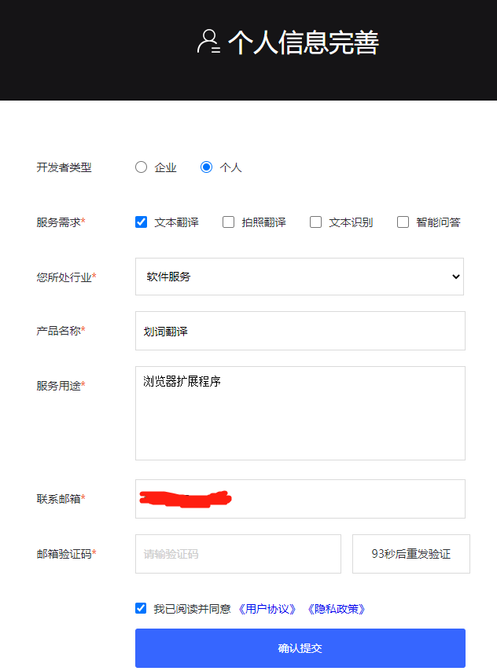
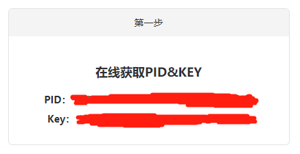

# 搜狗翻译

:::tip
文档内容可能会过时，请以搜狗翻译官网说明为准。

相关链接：[搜狗深智引擎](https://deepi.sogou.com/) [搜狗文本翻译定价文档](https://deepi.sogou.com/doccenter/texttranslatedoc)
:::

## 价格 {#prices}

搜狗翻译会**提供 100 元免费体验金，用完之后就要收费了，费用由搜狗翻译在它自己的[搜狗深智引擎](https://deepi.sogou.com/)收取，与划词翻译无关**。搜狗翻译的收费价格为常见语种跟中文互译为 40 元 / 百万字符，其它情况为 60 元 / 百万字符。

## 申请步骤 {#steps}

### 第一步：填写个人信息 {#register}

登录[搜狗深智引擎](https://deepi.sogou.com/)，登录之后会让你填写个人信息，如下图：

### 第二步：获取 PID 和 Key {#create-key}

填写个人信息之后，进入[用户中心](https://deepi.sogou.com/registered/account)，选择左侧的[机器翻译 - 文本翻译](https://deepi.sogou.com/registered/texttranslate)，点击【在线获取PID&KEY】下的【点击获取】按钮，就能看到 PID 和 Key 了，如下图：

### 第三步：在划词翻译中填写 PID 和 Key {#fill-in}

将 PID 和 Key 填写进划词翻译的【设置页】-【服务申请】即可。